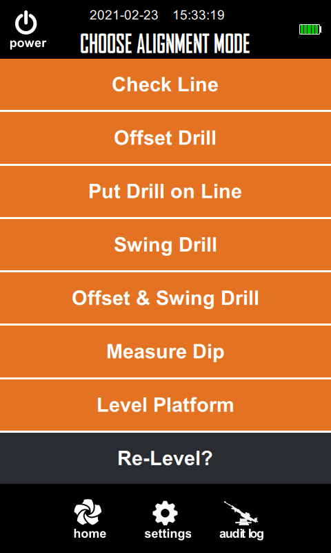

# <center> <h1>ApoStron Prototype User Interface</h1> </center>

## <center> <h2>Workflow Overview</h2> </center>

<p align="center">
  
</p>

## <center> <h2>There are 7 modes for this laser alignment/measurement device.</h2> </center>

<p align="center">
  
</p>

```r

```